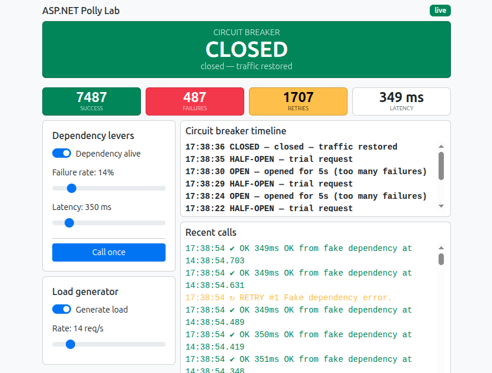

# ASP.NET Polly Lab

- Fake dependency that can be broken in various ways.
- **Polly** resilience layer that withstands those breakages.
- Live dashboard where it all shows up in real time.

**Stack:** ASP.NET Core (.NET 10) + Polly 8 + SignalR + a static Bootstrap dashboard (no Node, just CDN).



## How to trigger the stress

```bash
dotnet run
```

- **Slowness:** Latency → 1500 ms → timeouts and retries.
- **Failures:** Failure rate → 100% → retries, then a red OPEN.
- **Total down:** turn off Dependency alive → instant failures.
- **Volume:** turn on Generate load — and any scenario above becomes drama.

---

## Project map

```
Controllers/  FakeDepController, LoadGenController    ← HTTP entry points
FakeDep/      FakeDep, FakeDepState, FakeDepCaller    ← the "villain" + the single call path
LoadGen/      LoadGenService, LoadGenState            ← background load
Rslc/         RslcFakeDepPipeline                     ← ALL of Polly lives here
Sgr/          SgrHub, SgrService, SgrEvents           ← broadcasts events to the dashboard
wwwroot/      index.html, app.js                      ← dashboard
```

Flow of a single call:

```
LoadGenService / FakeDepController
        ↓
FakeDepCaller.CallOnceAsync          ← the single call point
        ↓
RslcFakeDepPipeline.Pipeline         ← CircuitBreaker → Retry → Timeout
        ↓
FakeDep.CallFakeDepAsync             ← fake dependency
        │
each event → SgrService.Broadcast → SignalR → app.js → dashboard
```

## RslcFakeDepPipeline — the heart

```
CircuitBreaker  (outer: decides whether to let the call through at all)
   └─ Retry     (repeats failed attempts)
       └─ Timeout   (1s per EACH attempt)
           └─ FakeDep.CallFakeDepAsync
```

## Two tokens in one line

```csharp
await rslc.Pipeline.ExecuteAsync(async token => await fakeDep.CallFakeDepAsync(token), ct);
```

- `ct` — the one **I give** to Polly (client-side cancellation);
- `token` — the one Polly **gives back** to me: a linked token = my `ct` + the timeout alarm.

## SignalR

`SgrService.Broadcast<TEvent>` — one generic method; the channel name is derived from the type name:
`SgrEvt_FakeDep_Called` → `"fakeDep_Called"`.
